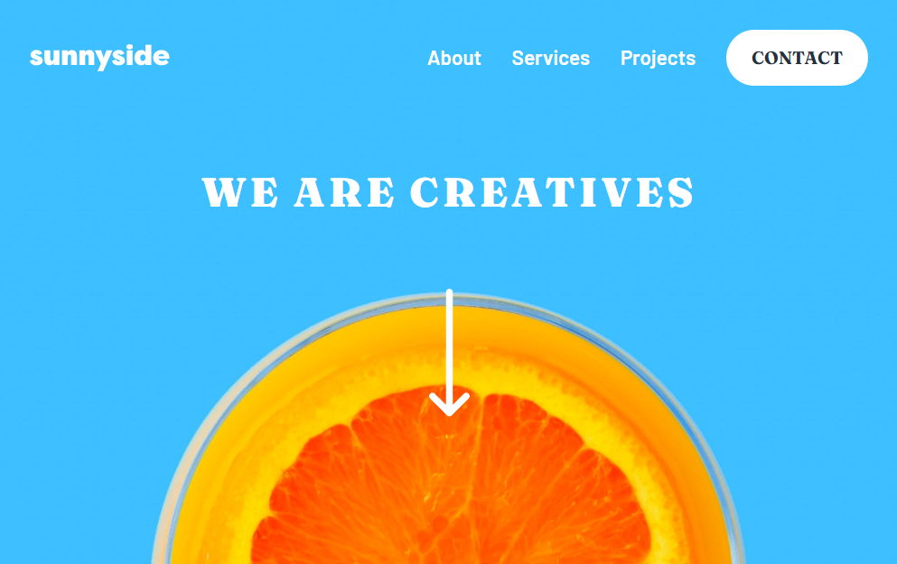

# Frontend Mentor - Sunnyside agency landing page solution

This is a solution to the [Sunnyside agency landing page challenge on Frontend Mentor](https://www.frontendmentor.io/challenges/sunnyside-agency-landing-page-7yVs3B6ef). Frontend Mentor challenges help you improve your coding skills by building realistic projects.

## Table of contents

- [Frontend Mentor - Sunnyside agency landing page solution](#frontend-mentor---sunnyside-agency-landing-page-solution)
  - [Table of contents](#table-of-contents)
  - [Overview](#overview)
    - [The challenge](#the-challenge)
    - [Screenshot](#screenshot)
    - [Links](#links)
  - [My process](#my-process)
    - [Built with](#built-with)
  - [Author](#author)

## Overview

### The challenge

Users should be able to:

- View the optimal layout for the site depending on their device's screen size
- See hover states for all interactive elements on the page

### Screenshot

### Links

- Solution URL: [https://www.frontendmentor.io/solutions/sunnyside-agency-landing-page-using-tailwind-css-and-alpinejs-HqWjX__jC6](https://www.frontendmentor.io/solutions/sunnyside-agency-landing-page-using-tailwind-css-and-alpinejs-HqWjX__jC6)
- Live Site URL: [https://ap2soft-sunnyside-agency-landing-page.netlify.app/](https://ap2soft-sunnyside-agency-landing-page.netlify.app/)

## My process

### Built with

- Semantic HTML5 markup
- Mobile-first workflow
- [Tailwind CSS](https://tailwindcss.com) - A utility-first CSS framework

## Author

- Website - [Andrew](https://ap2.dev)
- Twitter - [@andreich1980](https://www.twitter.com/andreich1980)
